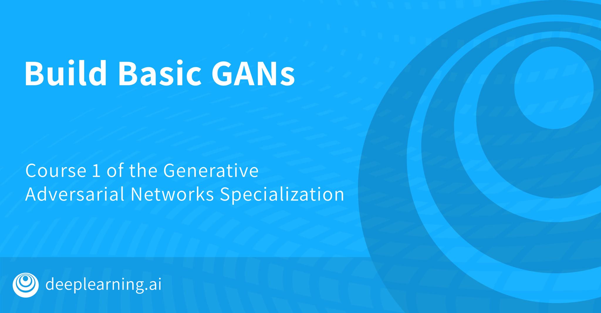

# Build Basic Generative Adversarial Networks

Welcome to the [first course](https://www.coursera.org/learn/build-basic-generative-adversarial-networks-gans](https://github.com/ajithpinninti/GAN-General-Adversial-Networks-/blob/main/Build%20Basic%20General%20Adversial%20Network/Week%203/MNIST_WGAN_Progression.png) of the Generative Adversarial Networks specialization at Coursera, offered by deepLearning.ai.
